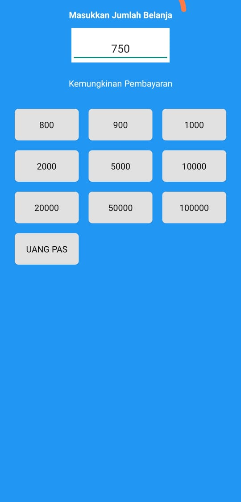

## ANDROID DEVELOPER -  JHOAN RIVER S

Thank you for your response to my application and continue to the study case. 
Here are the content of my project

- Project file 
- Provided file apk on Project/apk path
- Provided screenshot on Project/screenshot path


### Problem Solving
I know my code is not completely correct, but here I provided solution of money combination of groceries

```kotlin
fun findPossibly(amount: String) {
        _loading.value = true
        val nominal = listOf(100, 200, 500, 1000, 2000, 5000, 10000, 20_000, 50_000, 100_000)
        val collectDistinctValue = mutableListOf<String>()
        if(amount.toInt() < 100_000){
            val caraBayars = getPossiblyPays(amount.toInt(), nominal)
            for (i in caraBayars.size - 1 downTo 0) {
                val sum = caraBayars[i].sum()
                if(!collectDistinctValue.contains(sum.toString())){
                    collectDistinctValue.add(sum.toString())
                }
            }
        }
        collectDistinctValue.add(MainUtils.UANG_PAS)
        _loading.value = false
        _possiblyPays.value = collectDistinctValue

    }
```

findPossibly function called after user finished typing amount.
I instance **_loading** and **_possiblePays** as mutable live data.
_loading telling user for loading process, and _possiblePays is the result of possible payment.

**nominal** is a list of denominations. start from 100 until 100000. I set a restriction when the amount >= 100000, then just skip all the possible denomination and return result


```kotlin
private fun getPossiblyPays(amount: Int, denominations: List<Int>): List<List<Int>> {
        val reversedDenomination = denominations.reversed()
        val results = mutableListOf<List<Int>>()
        val current = mutableListOf<Int>()
        getCombination(amount, reversedDenomination, 0, current, results)
        return results
    }
```

```kotlin
private fun getCombination(amount: Int, denominations: List<Int>, idx: Int, current: MutableList<Int>, results: MutableSet<Int>) {
    if (idx == denominations.size) {
        return
    }
    if (amount <= 0) {
        results.add(current.sum())
        return
    }
    if(current.size > 20){
        return
    }
    current.add(denominations[idx])
    getCombination(amount - denominations[idx], denominations, idx, current, results)
    current.removeAt(current.size - 1)

    getCombination(amount, denominations, idx + 1, current, results)
}
```

getPossiblyPays has property current as list of combination possible value to reach amount.
The function will return list of increment of combination denomination as results.

Okay, let's dive into getCombination function. this function has params amount, denominations, index, current, and results.<br>
getCombination is a recursive function that will be called as long as **value of current amount minus item of denomination still more than 0** . <br>
I set restriction for current list size maximum is 20. If combination  more than 20, it will return nothing.

For every decrement of amount and denomintaion[idx] all the items will be collect in current list as long as results more than 0<br>
When it reach <= 0 then result add new item as current.sum()<br>

Remove the last item of current list so that it can be used for another combination. <br>
In next line, the recursive call getCombination used residue of amount, and ++idx for

## Screenshot

Here is the screenshot of the application <br>

<div align="center">
  
</div>

<br><br>

## Closing

I build the apk using fastlane, and put it inside project/apk path. I used MVVM as architecture, and commit this project to GitHub since I create the project. <br>
That's all that I can provide for the study case. For all of your attention I say thank you. Wish me luck <br><br>

Regards<br><br>

Jhoan


